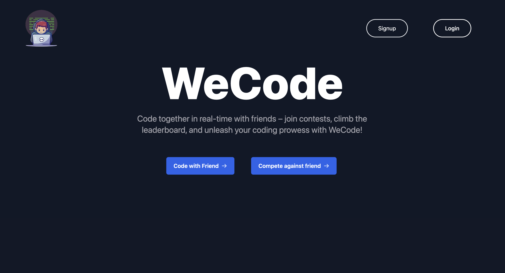

# WeCode Collaboration Platform

WeCode is a real-time collaboration platform designed for coding enthusiasts to code together, participate in coding contests, and communicate seamlessly.

## Key Features
- Real-time code editing with friends.
- Video and chat options for effective communication.
- Online coding contests with a win and leaderboard system.
- Dark theme for a comfortable coding experience.
- Consistent and user-friendly interface across all pages.

## Tech Stack
- React for the frontend user interface.
- GSAP for animations and interactive elements.
- MongoDB for data storage and management.
- Express for the backend server.
- Socket.IO for real-time communication.
- Tailwind CSS for consistent styling.
- WebRTC for video communication.

## How to Use
1. Sign up or log in to WeCode.
2. Create or join coding sessions with friends.
3. Participate in coding contests and climb the leaderboard.
4. Explore the dark-themed interface for a focused coding experience.

Contribute to WeCode and enhance the collaborative coding journey for developers worldwide!
